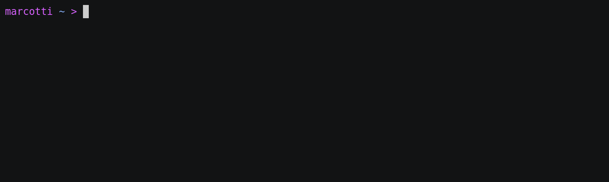

Getting started
===============

Installation
------------

Install ``remote_mole`` with::

    pip install remote-mole

Setting up a mole
-----------------

Well, for now, ``remote_mole`` only supports Discord as the interface which you can command the bot. Therefore, before registering the mole you will need to create a Discord bot. Don't worry! Is very easy following this documentation_. From this you only will need the Discord bot token.

.. _documentation: https://github.com/reactiflux/discord-irc/wiki/Creating-a-discord-bot-&-getting-a-token

Just do::

    remote_mole -register

And you will be prompted with questions about the type of mole that is going to live in your server. Most of them are super intuitive, but let's get through them.

**Discord bot token:**

Here you need to write the token of the Discord bot. If you don't have one yet, please read above!

**To what keyword should the bot listen:**

You will call your bot in discord by wring something like::

    <your keyword> tunnel ssh

So basically, the prefix word of the commands, i use something like ``hey mole!``

**Do you want to set up a ngrok token (recommended)**

Well, is recommended, so this docs also recommend you to press (Y). Beware, though it has nice benefits, you will need to accomplish an extra step.

**ngrok token:**
This is the extra step, you will have to register to ngrok_ and search there for your authtoken.

.. _ngrok: https://dashboard.ngrok.com/signup

**ngrok region:**

Just select the region closest to you and your server, for a better connection.

And it's done! Your mole is registered. Feel free to start it with::

    remote_mole -start

Add your bot to a Discord server
--------------------------------

To add your bot to a server in Discord, visit this docs_.

.. _docs: https://github.com/reactiflux/discord-irc/wiki/Creating-a-discord-bot-&-getting-a-token#adding-your-bot-to-your-server
